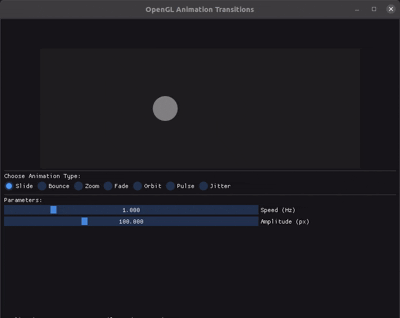

# opengl_animation_transitions
This is a simple desktop application that visualizes a few animation transitions. The purpose of this project is to learn about ImGui, C++ and CMake.

## To do
- Adding a build subtitle in the README that covers the build process.

## Animations
### Slide

### Bounce
### Zoom
### Fade
### Orbit
### Pulse
### Jitter
